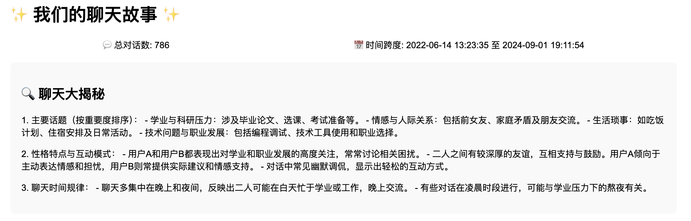
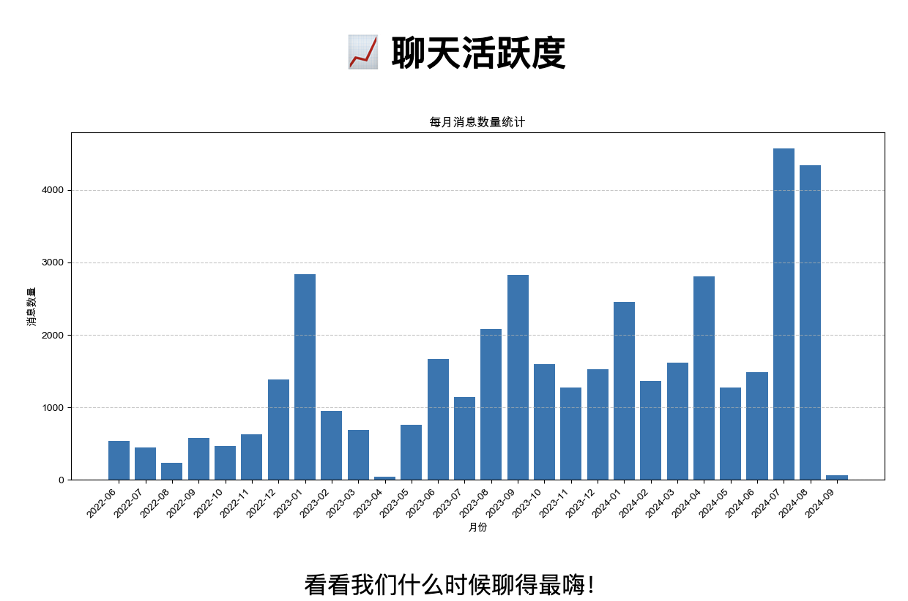
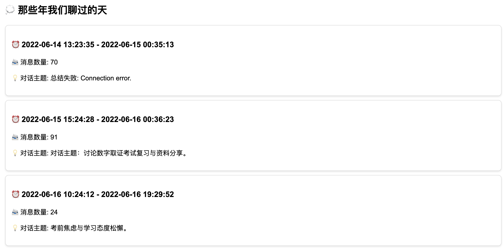

# 🗨️ 聊天分析神器：深度挖掘你的QQ和微信聊天记录！

厌倦了在聊天记录中无尽地翻找？用我们的聊天分析神器，**快速总结聊天精华**，发现对话中的隐藏价值！**告别耗时的手动翻查**，让AI帮你高效整理！**重温珍贵回忆**，感受与朋友之间的情感纽带！

示例pdf报告：[report.pdf](output/report.pdf)

## 🔥 为什么你会爱上它

✨ **双平台支持** - 完美兼容QQ和微信！  
💡 **智能主题识别** - 自动捕捉关键讨论话题！  
📊 **互动可视化** - 精美图表揭示聊天模式！  
📄 **专业报告** - 支持HTML和PDF格式，方便分享！  
🧠 **AI深度分析** - 基于Deepseek和GPT-4o的强大洞察力！  
⏱️ **高效总结** - 快速提炼聊天精华，节省大量时间！  
❤️ **情感回忆** - 重温与朋友的美好时光，感受珍贵情谊！

## 🚀 快速开始

### 第一步：获取聊天数据
- **QQ用户**：使用[QQ History Backup](https://github.com/Yiyiyimu/QQ-History-Backup) → 保存为`qq_messages.csv`  
- **微信用户**：使用[WeChatMsg](https://github.com/LC044/WeChatMsg) → 保存为`wechat_messages.csv`

### 第二步：运行魔法！
```bash
python analysis.py
```

## 📸 精彩展示

### 聊天大揭秘


### 聊天活跃度


### 那些年我们聊过的天


📣 **小贴士**：与朋友分享你的聊天统计数据！谁是最活跃的？什么话题主导了你们的对话？**无需翻看大量记录**，现在就来发现吧！**一起回忆那些年你们共同经历的点点滴滴**！

💬 "终于了解了自己的聊天习惯！**再也不用浪费时间翻记录了**" - 满意用户  
📈 "可视化报告太棒了！**帮我快速总结了多年聊天内容**" - 社交媒体爱好者  
❤️ "看着分析报告，**仿佛重温了和朋友一起度过的美好时光**" - 情感回忆者

👉 立即尝试，成为朋友圈里的聊天分析专家，**珍藏每一份珍贵情谊**！


